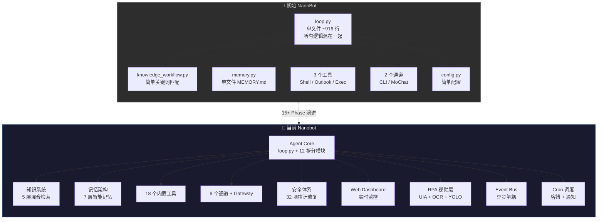
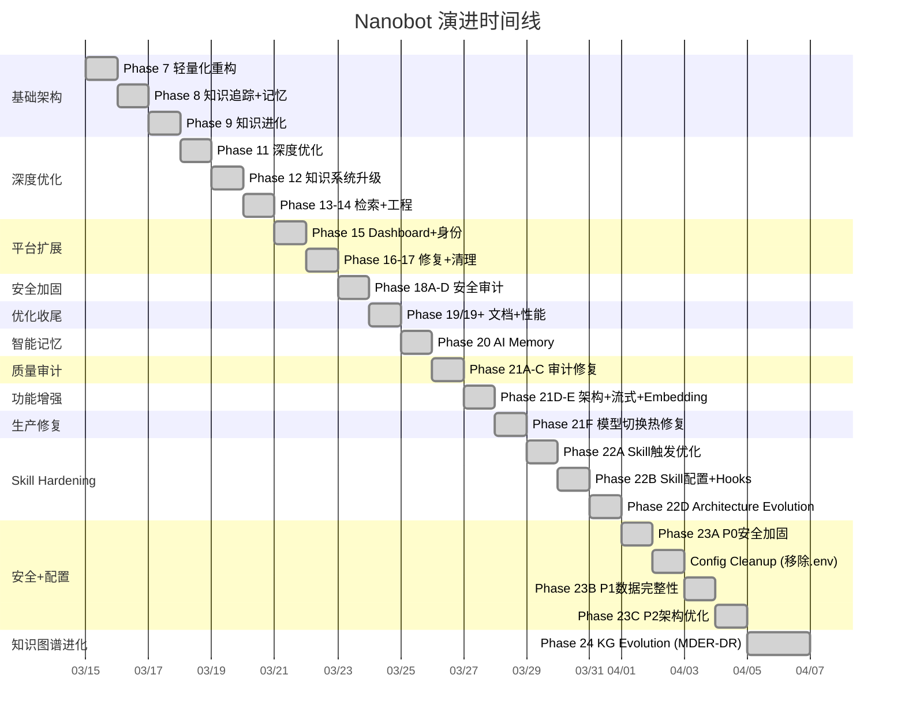

# Nanobot 演进全景对比

> 从一个简单的聊天机器人到企业级 AI Agent 框架的蜕变之路  
> 最后更新: 2026-03-21

---

## 工程规模对比

| 维度 | 🐣 初始 NanoBot | 🚀 当前 Nanobot | 增幅 |
|------|----------------|----------------|------|
| **核心源文件** | ~10 | **95** | **×9.5** |
| **测试文件** | 0 | **73** | 0 → 73 |
| **测试用例** | 0 | **948+ passed** | 0 → 948+ |
| **子包 (packages)** | 2 (`agent`, `config`) | **14** | **×7** |
| **内置工具 (Tools)** | 3 (shell, outlook, exec) | **18** | **×6** |
| **通道适配器 (Channels)** | 2 (CLI, MoChat) | **9** | **×4.5** |
| **Phase 迭代** | — | **15+ 个大阶段** | — |
| **论文参考** | 0 | **6** (AutoSkill, XSKILL, mem9, MemGPT, AI Memory Survey, MDER-DR) | — |

---

## 架构演进全景图



---

## 各维度详细对比

### 1. Agent 核心架构

| 方面 | 🐣 初始 | 🚀 当前 |
|------|---------|---------|
| **主循环** | `loop.py` 单文件 916 行，所有逻辑耦合 | `loop.py` 精简至 ~670 行，拆分出 12 个专职模块 |
| **状态管理** | 内联 if/else | `state_handler.py` 独立状态机 |
| **命令处理** | loop.py 内部硬编码 | `commands.py` + `command_recognition.py` 独立模块 |
| **工具注册** | loop.py 内部 | `tool_setup.py` 独立注册器 |
| **上下文构建** | 简单拼接 | `context.py` 智能预算分配（120K char budget） |
| **子代理** | 无 | `subagent.py` 完整子代理管理 |
| **国际化** | 硬编码中文 | `i18n.py` 统一 i18n 框架，50+ key |
| **并发工具执行** | 串行 | `asyncio.gather` 并行执行多工具 |
| **错误恢复** | 无 | 断路器（3 次连续全失败自动终止） |

### 2. 知识系统

| 方面 | 🐣 初始 | 🚀 当前 |
|------|---------|---------|
| **匹配方式** | 简单关键词精确匹配 | 5 层金字塔：精确 → 子串 → jieba 分词 → BM25 → Dense 向量 |
| **知识表示** | `{key, steps}` 2 字段 | `{key, steps, triggers, tags, description, anti_patterns, confidence, version, success/fail_count}` 结构化 |
| **学习机制** | 手动保存 | 隐式反馈 + 自动版本合并 + 相似检测 |
| **技能升级** | 无 | 成功≥3 次自动建议升级为永久 Python Skill |
| **知识管理** | 无 | `/kb list`、`/kb cleanup`（去重合并）、`/kb delete` |
| **Experience 层** | 无 | `experience_bank.py` — condition→action 战术级经验 |
| **Management Judge** | 无 | 规则驱动的 add/merge/discard 三分决策 |
| **Few-shot 注入** | 无 | 历史成功步骤自动注入 system prompt |
| **检索增强** | 无 | 查询改写（指代消解）+ 检索后适配（上下文裁剪） |

### 3. 记忆架构

| 方面 | 🐣 初始 | 🚀 当前 |
|------|---------|---------|
| **存储** | 单个 `MEMORY.md` 文件 | 7 层记忆架构 |
| **L1 偏好** | 无 | `personalization.py` — LLM 蒸馏核心偏好 |
| **L2 向量存储** | 无 | `vector_store.py` — ChromaDB 语义检索（时间衰减评分） |
| **L3 每日日志** | 无 | `memory/YYYY-MM-DD.md` 结构化日志 |
| **L4 上下文驱逐缓冲** | 无 | MemGPT 式虚拟内存分页 |
| **L5 慢路径整合** | 无 | CLS 风格的深度记忆合并 |
| **L6 元认知反射** | 无 | `reflection.py` — 自我反思的元认知记忆 |
| **L7 实体关系图** | 无 | `knowledge_graph.py` — 轻量级实体关系图谱 |
| **CRUD 工具** | 无 | 统一 `memory` 工具（store/search/delete + tags） |
| **容量控制** | 无 | 自动整合（每 20 条消息触发） |
| **视觉记忆** | 无 | 屏幕截图 OCR 文本持久化 + 去重 |
| **意图检测** | 无 | 自动识别 "记住"/"remember" 等触发短语 |
| **导入/导出** | 无 | `/memory export`、`/memory import` 命令 |

### 4. 工具生态

| 🐣 初始（3 个） | 🚀 当前（18 个） | 状态 |
|-----------------|-----------------|------|
| `shell` | `shell.py` — 加固沙箱 + 14 条 deny pattern | **强化** |
| `outlook` | `outlook.py` — COM 线程隔离 + 异步 | **强化** |
| `exec` (Python) | — (通过 shell 覆盖) | 内化 |
| — | `attachment_analyzer.py` — PDF/docx/xlsx/csv 通用解析 | **新增** |
| — | `cron.py` — 自然语言定时任务 | **新增** |
| — | `filesystem.py` — 文件系统操作 | **新增** |
| — | `memory_search_tool.py` — 记忆语义搜索 | **新增** |
| — | `message.py` — 跨通道消息推送 | **新增** |
| — | `rpa_executor.py` — UI 自动化执行 | **新增** |
| — | `screen_capture.py` — 截图 + Set-of-Marks 标注 | **新增** |
| — | `web.py` — Web 抓取 + PDF 支持 + SSRF 防护 | **新增** |
| — | `save_skill.py` — 保存永久技能 | **新增** |
| — | `save_experience.py` — 保存战术经验 | **新增** |
| — | `task_memory.py` — 任务记忆管理 | **新增** |
| — | `spawn.py` — 子代理派生 | **新增** |
| — | `mcp.py` — MCP 协议集成 | **新增** |
| — | `registry.py` — 工具注册统一管理 | **新增** |
| — | `base.py` — 工具基类抽象 | **新增** |

### 5. 通道 & 连接

| 🐣 初始（2 个） | 🚀 当前（9 个） | 备注 |
|-----------------|-----------------|------|
| CLI | CLI | 基础保留 |
| MoChat (企业微信) | MoChat — 提取 `mochat_utils.py` | 重构强化 |
| — | **Telegram** — 语音 STT + 富文本 | **新增** |
| — | **Discord** — Gateway WebSocket | **新增** |
| — | **Slack** — Events API | **新增** |
| — | **Email** — IMAP/SMTP 全双工 | **新增** |
| — | **飞书 (Feishu)** | **新增** |
| — | **钉钉 (DingTalk)** | **新增** |
| — | **WhatsApp** | **新增** |
| — | **QQ** | **新增** |
| — | **ChannelManager** — 数据驱动注册 + `allowFrom` 白名单 | **新增** |
| — | **Master Identity** — 跨通道身份统一 + 安全映射 | **新增** |

### 6. RPA & 视觉感知

| 方面 | 🐣 初始 | 🚀 当前 |
|------|---------|---------|
| **UI 自动化** | 无 | `rpa_executor.py` — UIAutomation API |
| **文字按名点击** | 无 | `ui_anchors.py` — `anchors.json` 名称匹配，跳过 VLM |
| **OCR** | 无 | `ocr_engine.py` — PaddleOCR 集成，UIA 失败时 fallback |
| **YOLO 检测** | 无 | `yolo_detector.py` — GPA-GUI-Detector 模型，无 Accessibility API 时视觉检测 |
| **Set-of-Marks** | 无 | 屏幕截图 + 标注框 + 编号，LLM 选择目标 |
| **多显示器** | 无 | 绝对→相对坐标转换，跨屏幕操作 |
| **VLM 路由** | 无 | 自动路由到视觉模型 + fallback 到默认模型 |

### 7. 安全体系

| 方面 | 🐣 初始 | 🚀 当前 |
|------|---------|---------|
| **Shell 沙箱** | 无限制 | 14 条 deny pattern + workspace 限制 + 解释器绕过防护 |
| **路径遍历防护** | 无 | `is_relative_to()` 检查 — shell/memory import/文件操作 |
| **API 认证** | 无 | Dashboard Bearer Token — HTTP + WebSocket 全覆盖 |
| **SSRF 防护** | 无 | RFC1918/loopback/link-local/metadata IP 阻断 |
| **WebSocket 限流** | 无 | 10KB 消息限制 + 30 msg/min 滑动窗口 |
| **API 限流** | 无 | Token Bucket 全局速率限制 |
| **网络绑定** | `0.0.0.0` | 默认 `127.0.0.1`，仅本机访问 |
| **API Key** | 不安全存储 | `~/.nanobot/config.json` 唯一配置源（不入 Git） |
| **错误消息** | 完整堆栈暴露 | 通用用户消息 + 日志详情分离 |
| **JSON 写入** | 直接写 | 原子写入（temp file + `os.replace()`） |
| **`<think>` 标签** | 内联正则分散 | 统一 `think_strip.py` 处理 |
| **审计总计** | 无 | **32 项安全问题全部修复** |

### 8. 可观测性 & 运维

| 方面 | 🐣 初始 | 🚀 当前 |
|------|---------|---------|
| **Web Dashboard** | 无 | FastAPI + HTML/JS — 实时 WebSocket 日志、KB/Memory 编辑、系统指标 |
| **Metrics** | 无 | `metrics.py` — LLM 调用计数、Token 用量、工具执行、错误恢复、Uptime |
| **`/stats` 命令** | 无 | 聊天内查看 token 汇总 + 系统运行指标 |
| **日志框架** | `print` | Loguru 统一结构化日志 |
| **Cron 监控** | 无 | 心跳容错 + 失败自动通知（Dashboard + 消息通道推送） |
| **Session 追踪** | 无 | JSONL 持久化 + LRU 缓存 + UTF-8 + pending 状态机 |

### 9. 工程质量

| 方面 | 🐣 初始 | 🚀 当前 |
|------|---------|---------|
| **测试覆盖** | 0 个测试 | **948+ passed** |
| **测试文件** | 0 | **74** |
| **类型提示** | 无 | 核心模块完整 type hints |
| **代码审计** | 无 | Phase 18 安全审计 + Phase 21 质量审计（32 项全修复） |
| **死代码清理** | 未管理 | 多轮清理 — Router/PreAnalyzer/Distiller 移除 |
| **模块化** | loop.py 916 行单体 | 拆分为 10+ 专职模块，loop.py 降至 ~670 行 |
| **LLM 容错** | 无 | 指数退避重试（max 2）— 仅对超时/5xx/连接错误 |
| **Hot Reload** | 无 | `/reload` 命令 — 热加载 plugins 目录 |
| **文档** | 无 | `PROJECT_STATUS.md`、`SECURITY.md`、`TOOLS.md`、`EVOLUTION.md` |

### 10. LLM & 模型集成

| 方面 | 🐣 初始 | 🚀 当前 |
|------|---------|---------|
| **模型支持** | 单一模型 | 多提供商统一注册：vLLM / Ollama / OpenRouter |
| **推理模型** | 不支持 | 完整 `<think>` 标签提取/过滤（DeepSeek-R1 等） |
| **Embedding** | 无 | `BAAI/bge-m3`（1024 维，100+ 语言，本地离线） |
| **VLM 路由** | 无 | 自动检测图片 → 路由到视觉模型 + fallback |
| **Token 追踪** | 无 | 累计 token 用量追踪 + `/stats` 展示 |
| **上下文管理** | 全量注入 | 字符预算分配 + 注入上限（8000 char budget cap） |
| **查询改写** | 无 | 代词检测短路 + LLM 指代消解 |

---

## 演进时间线



---

## 代码库结构对比

### 🐣 初始结构（~10 文件）

```
nanobot/
├── agent/
│   ├── loop.py              ← 916 行，所有逻辑
│   ├── knowledge_workflow.py
│   └── tools/
│       ├── shell.py
│       ├── outlook.py
│       └── exec.py
├── config/
│   └── config.py
├── channels/
│   ├── cli.py
│   └── mochat.py
└── __init__.py
```

### 🚀 当前结构（95 文件，14 子包）

```
nanobot/
├── agent/                   ← 25 核心模块
│   ├── loop.py              ← 670 行，精简主循环
│   ├── context.py           ← 智能上下文构建 (120K budget)
│   ├── state_handler.py     ← 独立状态机
│   ├── commands.py          ← 命令处理器
│   ├── command_recognition.py
│   ├── knowledge_workflow.py ← 350 行 facade
│   ├── key_extractor.py     ← Key 提取（LLM + fallback）
│   ├── knowledge_judge.py   ← 知识质量评判 + 保存/适配
│   ├── knowledge_graph.py   ← 实体关系图谱
│   ├── hybrid_retriever.py  ← Dense+BM25 混合检索
│   ├── memory.py
│   ├── memory_manager.py    ← 7 层记忆管理
│   ├── reflection.py        ← 元认知反射
│   ├── vector_store.py      ← ChromaDB 向量存储
│   ├── task_knowledge.py    ← 结构化知识表示
│   ├── personalization.py   ← L1 偏好蒸馏
│   ├── outcome_tracker.py   ← 隐式反馈
│   ├── prompt_formatter.py  ← Few-shot 格式化
│   ├── kb_commands.py       ← KB 管理命令
│   ├── skills.py            ← 技能管理
│   ├── subagent.py          ← 子代理
│   ├── tool_setup.py        ← 工具注册
│   ├── i18n.py              ← 国际化 50+ key
│   ├── tools/               ← 18 个内置工具
│   │   ├── shell.py         ← 加固沙箱
│   │   ├── outlook.py       ← COM 线程隔离
│   │   ├── rpa_executor.py  ← UI 自动化
│   │   ├── screen_capture.py← 截图 + Set-of-Marks
│   │   ├── web.py           ← Web 抓取 + SSRF 防护
│   │   ├── attachment_analyzer.py
│   │   ├── memory_search_tool.py
│   │   ├── cron.py
│   │   ├── filesystem.py
│   │   ├── message.py
│   │   ├── save_skill.py
│   │   ├── save_experience.py
│   │   ├── task_memory.py
│   │   ├── spawn.py
│   │   ├── mcp.py
│   │   ├── registry.py
│   │   └── base.py
│   └── vision/              ← 3 层视觉感知
│       ├── ocr_engine.py    ← PaddleOCR
│       ├── ui_anchors.py    ← UIAutomation 锚点
│       └── yolo_detector.py ← YOLO UI 检测
├── bus/                     ← 事件总线
├── channels/                ← 9 通道适配器
│   ├── manager.py           ← 数据驱动注册
│   ├── base.py
│   ├── mochat.py / mochat_utils.py
│   ├── telegram.py / discord.py / slack.py
│   ├── email.py / feishu.py / dingtalk.py
│   ├── whatsapp.py / qq.py
│   └── ...
├── cli/                     ← CLI 交互
├── config/                  ← 配置管理 + Schema 校验
├── cron/                    ← Cron 调度 + 容错
├── dashboard/               ← Web Dashboard (FastAPI)
├── heartbeat/               ← 心跳守护
├── plugins/                 ← 动态插件目录
├── providers/               ← LLM 统一提供商
├── session/                 ← 会话持久化 + LRU
├── skills/                  ← 永久技能存储
├── utils/                   ← 工具库
│   ├── metrics.py           ← 可观测指标
│   ├── think_strip.py       ← <think> 清理
│   └── helpers.py
├── compute.py               ← 进程池计算卸载
├── plugin_loader.py         ← 热加载器
└── onboard.py               ← 技能安装器

tests/                       ← 74 测试文件，811 用例
```

---

## 关键数据总结

```
┌──────────────────────────────────────────────────────┐
│                  NanoBot → Nanobot                   │
│                                                      │
│  源文件:     ~10  →  95     (×9.5)                   │
│  测试用例:     0  →  811                             │
│  工具:         3  →  18     (×6)                     │
│  通道:         2  →  9      (×4.5)                   │
│  子包:         2  →  14     (×7)                     │
│  安全修复:     0  →  32 项全部完成                    │
│  记忆层级:     1  →  7 层智能架构                    │
│  检索策略:     1  →  5 层混合金字塔                  │
│  视觉感知:     0  →  3 层 (UIA+OCR+YOLO)            │
│  论文参考:     0  →  5 篇                            │
│                                                      │
│  "Nano" in name only 😄                              │
└──────────────────────────────────────────────────────┘
```

---

*本文档由 AI 辅助生成，基于项目 `todo.md` 和 `PROJECT_STATUS.md` 梳理。*

---

## Phase 22: Skill System Hardening & Architecture ✅

> 受 Anthropic 工程师 @trq212 的文章 "Lessons from Building Claude Code: How We Use Skills" 启发，
> 我们将 Skill 系统的最佳实践融入了 Phase 22 路线图。
> 
> 详见：
> - `ARCHITECTURE_LESSONS.md` — 我们自己的 10 条架构经验总结（社区分享文章）
> - `PROJECT_STATUS.md` § Phase 22 — Skill System Hardening & Architecture Refinement

### Phase 22D — Architecture Evolution ✅

- **AE1: Event-Driven Architecture Enhancement** — Extended `MessageBus` with typed domain events (`DomainEvent` base + 6 subclasses). Topic-based pub/sub with wildcard `"*"` support. Dashboard WebSocket forwarding for real-time observability.
- **AE2: Session Save Optimization** — Added metadata dirty flag to `Session`. Append-only save mode when only new messages are added. SQLite evaluated and deferred — JSONL is sufficient.
- New tests: 35 passed, 1 skipped. **Regression: 847 passed.**

### Phase 23A — P0 Security Hardening ✅

- **R1: Dashboard POST Input Validation** — Added 1MB body size limit to `POST /api/memory` and `POST /api/tasks` to prevent DoS via oversized payloads (HTTP 413).
- **R2: hooks.py Sandbox Hardening** — Three security layers: workspace-only path restriction, 50KB file size limit, and static scan blocking dangerous imports (`os`, `subprocess`, `shutil`, `sys`).
- **R4: SSRF DNS Rebinding Fix** — Replaced pre-flight `_is_internal_address()` check with `_SSRFSafeTransport` (custom `httpx.AsyncBaseTransport`) that validates resolved IPs at connect time, closing TOCTOU vulnerability.
- **R5: Token Log Masking** — Dashboard auto-generated token now masked in logs (shows only first 8 chars + `***`).
- New tests: 14 passed. **Regression: 924+ passed.**

### Config Cleanup (2026-03-21) ✅

- Removed redundant `.env` overlay — `~/.nanobot/config.json` is now the **sole** configuration source.
- Changed `Config` from `pydantic_settings.BaseSettings` to `pydantic.BaseModel`.
- Removed `pydantic-settings` dependency.
- Created `config.sample.json` (Git-tracked template, replaces `.env.example`).
- Deleted `.env.example`.

### Phase 23B — P1 Data Integrity & Architecture Fixes ✅

- **R3: Atomic Writes** — Session and Cron stores use temp-file + `os.replace()`.
- **R7: Cron Full UUID** — Cron job IDs use full 36-char UUID instead of truncated 8-char.
- **R8: Config Singleton** — Ensured single `Config` instance across all modules via `get_config()`.
- **R9/R15: Dead WebSocket Cleanup** — Failed WebSocket connections removed on send error.
- **R10: LRU Key Extraction Cache** — True LRU eviction via `OrderedDict` (cap=128).
- **R13: Session Key Restoration** — Original key persisted in JSONL metadata; `list_sessions()` uses it.
- New tests: 15 passed. **Regression: 948 passed.**

### Phase 23C — P2 Architecture Polish & Edge Hardening ✅

- **R11: Image Size Limit** — `_build_user_content()` skips images >20 MB with warning log.
- **R6: Write File Size Limit** — `WriteFileTool` rejects content >10 MB to prevent disk exhaustion.
- **R14: VLM Env Override** — VLM dynamic route uses direct assignment (`os.environ[key] = value`) instead of `setdefault`.
- **R16: SHA256 Visual Hash** — Visual memory dedup hash upgraded from MD5+12 chars to SHA256+16 chars.
- **R12: Outlook State Docs** — Documented per-instance state scope and future isolation path.
- New tests: 7 passed. **Regression: 948 passed** (2 pre-existing failures unrelated).

### Phase 24 — Knowledge Graph Evolution (MDER-DR) ✅

> 受 MDER-DR 论文 (arXiv 2603.11223) 启发："将多跳推理的复杂性从查询时移到索引时"

| ID | Item | File(s) | Description |
|----|------|---------|-------------|
| KG1 | Triple Description Enrichment | `knowledge_graph.py` | 每个三元组附带自然语言 `description` 字段，保留提取时的时间、条件、范围等上下文信息。`extract_triples` LLM prompt 同时请求描述。`get_1hop_context` 输出包含描述。 |
| KG2 | Entity Disambiguation | `knowledge_graph.py` | 轻量级实体消歧：子串包含 + 长度比例守卫（>30%）。自动合并 "David" → "David Liu" 等等价实体，存储 `aliases` 映射。支持手动 `add_alias()`。 |
| KG3 | Entity-Centric Summaries | `knowledge_graph.py`, `context.py`, `memory_manager.py` | 为每个实体预生成 LLM 聚合摘要，存储在 `graph.json` 的 `entities` 索引中。`get_entity_context()` 替代 `get_1hop_context()` 作为首选注入方式。深度整合后自动重新生成摘要。 |
| KG4 | Query Decomposition (DR) | `knowledge_graph.py` | `_is_complex_query()` 启发式检测多跳查询（中英文模式）。`decompose_query()` 将复杂查询分解为子查询链。`resolve_multihop()` 迭代解析并收集上下文。 |
| KG5 | Semantic Chunking | `knowledge_graph.py` | `_semantic_chunk()` 在三元组提取前按段落和句子边界切分长文本（支持中英文），无需 embedding 调用。 |

- `knowledge_graph.py` 从 216 行扩展至 ~450 行，保持轻量。
- `context.py` 更新为优先使用实体摘要注入（KG3），无摘要时回退到 1-hop。
- `memory_manager.py` 在深度整合后链式触发 `extract_triples()` → `generate_entity_summaries()`。
- New tests: `test_phase24_knowledge_graph.py` (31 tests). **Regression: 979 passed** (2 pre-existing env-dependent failures).

### Phase 25 — Project Retrospective & Hardening ✅

> 系统性代码审查（15+ 核心模块），识别并修复 7 个 bug / 健壮性 / 安全边缘问题。

| ID | Severity | File(s) | Description |
|----|----------|---------|-------------|
| F1 | P1-Bug | `dashboard/app.py` | WebSocket 断连异常处理覆盖：新增 `except Exception` 兜底，防止非 `WebSocketDisconnect` 异常导致 `_active_websockets` 残留 |
| F2 | P1-Bug | `session/manager.py` | 追加模式下 `updated_at` 不更新：在 append-only 路径更新时间戳，每 10 条消息标记 metadata dirty |
| F3 | P2-Robustness | `dashboard/app.py` | POST 接口 JSON 解析：`update_memory` / `update_tasks` 新增 `json.JSONDecodeError` 捕获，返回 400 而非 500 |
| F4 | P2-Robustness | `config/loader.py` | `save_config` 原子写入：统一使用 tempfile + `os.replace()` 防止进程崩溃时配置文件损坏 |
| F5 | P2-Performance | `knowledge_graph.py` | 移除 `_add_triple` 中的单次 `_save()` 调用，消除批量提取时 N 次冗余磁盘写入 |
| F7 | P3-Security | `web.py` | `WebSearchTool` 统一使用 `_SSRFSafeTransport`，与 `WebFetchTool` 保持一致 |
| F8 | P3-Robustness | `cron/service.py` | `_load_store` 显式指定 `encoding="utf-8"`，修复 Windows 非 ASCII 路径潜在问题 |

- 无新增测试文件（修复均为防御性改进，已被现有 979 个测试覆盖）。**Regression: 979 passed.**

### Phase 26 — Playwright Browser Automation 🔜 (Planned)

> 完整 Web RPA 方案，与桌面 RPA (UIA/OCR/YOLO) 互补。架构：Skill + Tool Hybrid 按需加载。

| Sub-Phase | Scope | Status |
|-----------|-------|--------|
| **26A** | Plugin Dependency Management — SK7 扩展 + `BrowserConfig` | ❌ |
| **26B** | Playwright Skill + BrowserTool Plugin — 11 action + 双层 SSRF + 渐进信任域名 | ❌ |
| **26C** | Session 加密持久化 (DPAPI) + Trust Manager + TTL | ❌ |

关键设计：
- `skills/browser-automation/SKILL.md` (Skill 层) + `plugins/browser.py` (Tool 层)
- 渐进信任：主导航首次授权 → 永久记住，子请求仅阻断内网 IP
- DPAPI 加密 Cookie 持久化，域名隔离，TTL 过期
- `browser` 管 Web 应用，`rpa` 管桌面应用，LLM 自动路由

