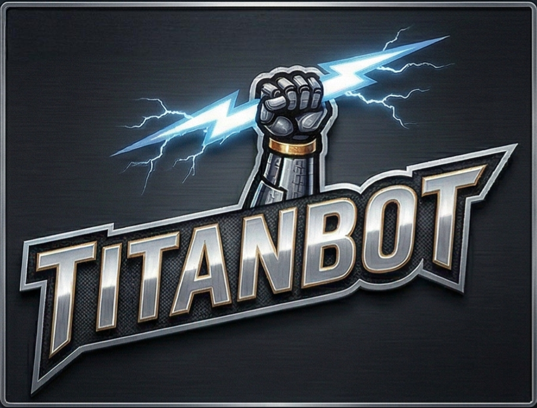

<div align="center">
  
  <h1>TitanBot: Enterprise AI Agent Framework</h1>
  <p>
    
    
    
    
    
  </p>
  <p>
    <em>Built upon <a href="https://github.com/HKUDS/nanobot">nanobot</a> by HKUDS — extended through 25 phases of evolution, 6 academic papers, and 979 tests.</em>
  </p>
</div>

## 🙏 Attribution & Acknowledgment

> **TitanBot** is a derivative work based on [nanobot](https://github.com/HKUDS/nanobot) by [HKUDS](https://github.com/HKUDS), licensed under the [MIT License](./LICENSE).
>
> We deeply respect the original nanobot team's work. Starting from their elegant ultra-lightweight foundation (~10 files, ~4,000 lines), we extended the project through **25 major phases** of independent development, incorporating insights from **6 academic papers** to build an enterprise-grade AI agent framework.
>
> All original code is used in compliance with the MIT License. The original copyright notice is preserved in our [LICENSE](./LICENSE) file.

---

## 🚀 What We Built — Evolution from nanobot

TitanBot started as a fork of nanobot and grew into a significantly enhanced AI agent framework. Here's what changed:

| Dimension | 🐣 Original nanobot | 🚀 TitanBot | Growth |
|-----------|---------------------|-------------|--------|
| **Core source files** | ~10 | **95** | ×9.5 |
| **Test cases** | 0 | **979+ passed** | 0 → 979 |
| **Built-in tools** | 3 | **18** | ×6 |
| **Channel adapters** | 2 | **9** | ×4.5 |
| **Sub-packages** | 2 | **14** | ×7 |
| **Memory layers** | 1 (single file) | **7-layer architecture** | ×7 |
| **Knowledge retrieval** | keyword match | **5-layer hybrid pyramid** | 5 strategies |
| **Security fixes** | 0 | **32 items** | 0 → 32 |
| **Academic papers referenced** | 0 | **6** | — |

### 📚 Academic Papers Referenced

Our enhancements were inspired by and implement ideas from the following papers:

| Paper | Key Contribution to TitanBot |
|-------|------------------------------|
| **AutoSkill** | Automated skill extraction and upgrade pipeline |
| **XSKILL** | Cross-domain skill transfer and taxonomy |
| **mem9** | Hierarchical memory architecture design |
| **MemGPT** | Virtual memory paging and context eviction |
| **AI Memory Survey** | Comprehensive memory system design patterns |
| **MDER-DR** (arXiv 2603.11223) | Knowledge graph evolution — "move multi-hop complexity from query-time to index-time" |

### 🏗️ Key Enhancements Over Original

- **7-Layer Memory Architecture** — From a single `MEMORY.md` file to: L1 Personalization → L2 Vector Store → L3 Daily Logs → L4 Context Eviction → L5 Deep Consolidation → L6 Meta-cognitive Reflection → L7 Knowledge Graph
- **5-Layer Hybrid Retrieval** — Exact match → Substring → Jieba tokenization → BM25 → Dense vector retrieval
- **Knowledge Graph with MDER-DR** — Triple descriptions, entity disambiguation, entity summaries, query decomposition, semantic chunking
- **RPA & Visual Perception** — 3-layer vision: UIAutomation + PaddleOCR + YOLO UI detection
- **Enterprise Security** — 32 security fixes across 4 audit phases, including SSRF protection, shell sandboxing, API rate limiting
- **Event-Driven Architecture** — Typed domain events, topic-based pub/sub, real-time dashboard
- **Skill System Hardening** — Configurable skills, pre/post hooks, skill registry with versioning

See [EVOLUTION.md](./EVOLUTION.md) for the complete evolution timeline and detailed comparisons.

---

## ✨ Features

<table align="center">
  <tr align="center">
    <th><p align="center">📈 24/7 Real-Time Market Analysis</p></th>
    <th><p align="center">🚀 Full-Stack Software Engineer</p></th>
    <th><p align="center">📅 Smart Daily Routine Manager</p></th>
    <th><p align="center">📚 Personal Knowledge Assistant</p></th>
  </tr>
  <tr>
    <td align="center"><p align="center"></p></td>
    <td align="center"><p align="center"></p></td>
    <td align="center"><p align="center"></p></td>
    <td align="center"><p align="center"></p></td>
  </tr>
  <tr>
    <td align="center">Discovery • Insights • Trends</td>
    <td align="center">Develop • Deploy • Scale</td>
    <td align="center">Schedule • Automate • Organize</td>
    <td align="center">Learn • Memory • Reasoning</td>
  </tr>
</table>

> **Note:** Feature demos above are from the original nanobot project. TitanBot inherits and extends all of these capabilities.

## 🏗️ Architecture

<p align="center">
  
</p>

> [!NOTE] 
> **For Developers and AI Agents (LLMs)**: Before modifying the codebase or adding new skills, please read `PROJECT_STATUS.md` for a comprehensive overview of the current project state, recently integrated features, and easily portable skills located in the `resources/` directory.

## 📦 Install

**Install from source** (recommended)

```bash
git clone https://github.com/HOTHOTCOOLCOOL/nanobot.git
cd nanobot
pip install -e .
```

**Install with [uv](https://github.com/astral-sh/uv)** (fast)

```bash
uv pip install -e .
```

## 🚀 Quick Start

> [!TIP]
> Set your API key in `~/.nanobot/config.json`.
> Get API keys: [OpenRouter](https://openrouter.ai/keys) (Global) · [Brave Search](https://brave.com/search/api/) (optional, for web search)

**1. Initialize**

```bash
nanobot onboard
```

**2. Configure** (`~/.nanobot/config.json`)

Add or merge these **two parts** into your config (other options have defaults).

*Set your API key* (e.g. OpenRouter, recommended for global users):
```json
{
  "providers": {
    "openrouter": {
      "apiKey": "sk-or-v1-xxx"
    }
  }
}
```

*Set your model*:
```json
{
  "agents": {
    "defaults": {
      "model": "anthropic/claude-opus-4-5"
    }
  }
}
```

**3. Chat**

```bash
nanobot agent
```

That's it! You have a working AI assistant in 2 minutes.

## 💬 Chat Apps

Connect TitanBot to your favorite chat platform.

| Channel | What you need |
|---------|---------------|
| **Telegram** | Bot token from @BotFather |
| **Discord** | Bot token + Message Content intent |
| **WhatsApp** | QR code scan |
| **Feishu** | App ID + App Secret |
| **DingTalk** | App Key + App Secret |
| **Slack** | Bot token + App-Level token |
| **Email** | IMAP/SMTP credentials |
| **QQ** | App ID + App Secret |

<details>
<summary><b>Telegram</b> (Recommended)</summary>

**1. Create a bot**
- Open Telegram, search `@BotFather`
- Send `/newbot`, follow prompts
- Copy the token

**2. Configure**

```json
{
  "channels": {
    "telegram": {
      "enabled": true,
      "token": "YOUR_BOT_TOKEN",
      "allowFrom": ["YOUR_USER_ID"]
    }
  }
}
```

> You can find your **User ID** in Telegram settings. It is shown as `@yourUserId`.
> Copy this value **without the `@` symbol** and paste it into the config file.


**3. Run**

```bash
nanobot gateway
```

</details>

<details>
<summary><b>Discord</b></summary>

**1. Create a bot**
- Go to https://discord.com/developers/applications
- Create an application → Bot → Add Bot
- Copy the bot token

**2. Enable intents**
- In the Bot settings, enable **MESSAGE CONTENT INTENT**

**3. Get your User ID**
- Discord Settings → Advanced → enable **Developer Mode**
- Right-click your avatar → **Copy User ID**

**4. Configure**

```json
{
  "channels": {
    "discord": {
      "enabled": true,
      "token": "YOUR_BOT_TOKEN",
      "allowFrom": ["YOUR_USER_ID"]
    }
  }
}
```

**5. Invite the bot**
- OAuth2 → URL Generator
- Scopes: `bot`
- Bot Permissions: `Send Messages`, `Read Message History`
- Open the generated invite URL and add the bot to your server

**6. Run**

```bash
nanobot gateway
```

</details>

<details>
<summary><b>WhatsApp</b></summary>

Requires **Node.js ≥18**.

**1. Link device**

```bash
nanobot channels login
# Scan QR with WhatsApp → Settings → Linked Devices
```

**2. Configure**

```json
{
  "channels": {
    "whatsapp": {
      "enabled": true,
      "allowFrom": ["+1234567890"]
    }
  }
}
```

**3. Run** (two terminals)

```bash
# Terminal 1
nanobot channels login

# Terminal 2
nanobot gateway
```

</details>

<details>
<summary><b>Feishu (飞书)</b></summary>

Uses **WebSocket** long connection — no public IP required.

**1. Create a Feishu bot**
- Visit [Feishu Open Platform](https://open.feishu.cn/app)
- Create a new app → Enable **Bot** capability
- **Permissions**: Add `im:message` (send messages)
- **Events**: Add `im.message.receive_v1` (receive messages)
  - Select **Long Connection** mode
- Get **App ID** and **App Secret** from "Credentials & Basic Info"
- Publish the app

**2. Configure**

```json
{
  "channels": {
    "feishu": {
      "enabled": true,
      "appId": "cli_xxx",
      "appSecret": "xxx",
      "encryptKey": "",
      "verificationToken": "",
      "allowFrom": []
    }
  }
}
```

> `encryptKey` and `verificationToken` are optional for Long Connection mode.
> `allowFrom`: Leave empty to allow all users, or add `["ou_xxx"]` to restrict access.

**3. Run**

```bash
nanobot gateway
```

> [!TIP]
> Feishu uses WebSocket to receive messages — no webhook or public IP needed!

</details>

<details>
<summary><b>QQ (QQ单聊)</b></summary>

Uses **botpy SDK** with WebSocket — no public IP required. Currently supports **private messages only**.

**1. Register & create bot**
- Visit [QQ Open Platform](https://q.qq.com) → Register as a developer
- Create a new bot application
- Go to **开发设置** → copy **AppID** and **AppSecret**

**2. Configure**

```json
{
  "channels": {
    "qq": {
      "enabled": true,
      "appId": "YOUR_APP_ID",
      "secret": "YOUR_APP_SECRET",
      "allowFrom": []
    }
  }
}
```

**3. Run**

```bash
nanobot gateway
```

</details>

<details>
<summary><b>DingTalk (钉钉)</b></summary>

Uses **Stream Mode** — no public IP required.

**1. Create a DingTalk bot**
- Visit [DingTalk Open Platform](https://open-dev.dingtalk.com/)
- Create a new app -> Add **Robot** capability
- Toggle **Stream Mode** ON
- Get **AppKey** and **AppSecret** from "Credentials"
- Publish the app

**2. Configure**

```json
{
  "channels": {
    "dingtalk": {
      "enabled": true,
      "clientId": "YOUR_APP_KEY",
      "clientSecret": "YOUR_APP_SECRET",
      "allowFrom": []
    }
  }
}
```

**3. Run**

```bash
nanobot gateway
```

</details>

<details>
<summary><b>Slack</b></summary>

Uses **Socket Mode** — no public URL required.

**1. Create a Slack app**
- Go to [Slack API](https://api.slack.com/apps) → **Create New App** → "From scratch"

**2. Configure the app**
- **Socket Mode**: Toggle ON → Generate an **App-Level Token** with `connections:write` scope → copy it (`xapp-...`)
- **OAuth & Permissions**: Add bot scopes: `chat:write`, `reactions:write`, `app_mentions:read`
- **Event Subscriptions**: Toggle ON → Subscribe to bot events: `message.im`, `message.channels`, `app_mention`
- **App Home**: Enable **Messages Tab** → Check **"Allow users to send Slash commands and messages from the messages tab"**
- **Install App**: Click **Install to Workspace** → copy the **Bot Token** (`xoxb-...`)

**3. Configure TitanBot**

```json
{
  "channels": {
    "slack": {
      "enabled": true,
      "botToken": "xoxb-...",
      "appToken": "xapp-...",
      "groupPolicy": "mention"
    }
  }
}
```

**4. Run**

```bash
nanobot gateway
```

> [!TIP]
> - `groupPolicy`: `"mention"` (default — respond only when @mentioned), `"open"` (respond to all), or `"allowlist"`.
> - DM policy defaults to open. Set `"dm": {"enabled": false}` to disable DMs.

</details>

<details>
<summary><b>Email</b></summary>

Give TitanBot its own email account. It polls **IMAP** for incoming mail and replies via **SMTP**.

**1. Get credentials (Gmail example)**
- Create a dedicated Gmail account for your bot
- Enable 2-Step Verification → Create an [App Password](https://myaccount.google.com/apppasswords)

**2. Configure**

> - `consentGranted` must be `true` to allow mailbox access.
> - `allowFrom`: Leave empty to accept emails from anyone.

```json
{
  "channels": {
    "email": {
      "enabled": true,
      "consentGranted": true,
      "imapHost": "imap.gmail.com",
      "imapPort": 993,
      "imapUsername": "my-bot@gmail.com",
      "imapPassword": "your-app-password",
      "smtpHost": "smtp.gmail.com",
      "smtpPort": 587,
      "smtpUsername": "my-bot@gmail.com",
      "smtpPassword": "your-app-password",
      "fromAddress": "my-bot@gmail.com",
      "allowFrom": ["your-real-email@gmail.com"]
    }
  }
}
```

**3. Run**

```bash
nanobot gateway
```

</details>

## ⚙️ Configuration

Config file: `~/.nanobot/config.json`

### Providers

> [!TIP]
> - **Groq** provides free voice transcription via Whisper.
> - **Zhipu Coding Plan**: Set `"apiBase": "https://open.bigmodel.cn/api/coding/paas/v4"` in your zhipu config.

| Provider | Purpose | Get API Key |
|----------|---------|-------------|
| `custom` | Any OpenAI-compatible endpoint | — |
| `openrouter` | LLM (recommended, all models) | [openrouter.ai](https://openrouter.ai) |
| `anthropic` | LLM (Claude direct) | [console.anthropic.com](https://console.anthropic.com) |
| `openai` | LLM (GPT direct) | [platform.openai.com](https://platform.openai.com) |
| `deepseek` | LLM (DeepSeek direct) | [platform.deepseek.com](https://platform.deepseek.com) |
| `groq` | LLM + Voice transcription (Whisper) | [console.groq.com](https://console.groq.com) |
| `gemini` | LLM (Gemini direct) | [aistudio.google.com](https://aistudio.google.com) |
| `minimax` | LLM (MiniMax direct) | [platform.minimax.io](https://platform.minimax.io) |
| `aihubmix` | LLM (API gateway) | [aihubmix.com](https://aihubmix.com) |
| `siliconflow` | LLM (SiliconFlow) | [siliconflow.cn](https://siliconflow.cn) |
| `dashscope` | LLM (Qwen) | [dashscope.console.aliyun.com](https://dashscope.console.aliyun.com) |
| `moonshot` | LLM (Moonshot/Kimi) | [platform.moonshot.cn](https://platform.moonshot.cn) |
| `zhipu` | LLM (Zhipu GLM) | [open.bigmodel.cn](https://open.bigmodel.cn) |
| `vllm` | LLM (local) | — |
| `openai_codex` | LLM (Codex, OAuth) | `nanobot provider login openai-codex` |
| `github_copilot` | LLM (GitHub Copilot, OAuth) | `nanobot provider login github-copilot` |

<details>
<summary><b>Custom Provider (Any OpenAI-compatible API)</b></summary>

Connects directly to any OpenAI-compatible endpoint — LM Studio, llama.cpp, Together AI, Azure OpenAI, etc.

```json
{
  "providers": {
    "custom": {
      "apiKey": "your-api-key",
      "apiBase": "https://api.your-provider.com/v1"
    }
  },
  "agents": {
    "defaults": {
      "model": "your-model-name"
    }
  }
}
```

> For local servers that don't require a key, set `apiKey` to any non-empty string (e.g. `"no-key"`).

</details>

<details>
<summary><b>vLLM (local / OpenAI-compatible)</b></summary>

Run your own model with vLLM or any OpenAI-compatible server:

**1. Start the server**:
```bash
vllm serve meta-llama/Llama-3.1-8B-Instruct --port 8000
```

**2. Add to config**:

```json
{
  "providers": {
    "vllm": {
      "apiKey": "dummy",
      "apiBase": "http://localhost:8000/v1"
    }
  },
  "agents": {
    "defaults": {
      "model": "meta-llama/Llama-3.1-8B-Instruct"
    }
  }
}
```

</details>

<details>
<summary><b>Adding a New Provider (Developer Guide)</b></summary>

TitanBot uses a **Provider Registry** (`nanobot/providers/registry.py`) as the single source of truth.
Adding a new provider only takes **2 steps**.

**Step 1.** Add a `ProviderSpec` entry to `PROVIDERS` in `nanobot/providers/registry.py`:

```python
ProviderSpec(
    name="myprovider",
    keywords=("myprovider", "mymodel"),
    env_key="MYPROVIDER_API_KEY",
    display_name="My Provider",
    litellm_prefix="myprovider",
    skip_prefixes=("myprovider/",),
)
```

**Step 2.** Add a field to `ProvidersConfig` in `nanobot/config/schema.py`:

```python
class ProvidersConfig(BaseModel):
    ...
    myprovider: ProviderConfig = ProviderConfig()
```

That's it! Environment variables, model prefixing, config matching, and status display all work automatically.

</details>


### MCP (Model Context Protocol)

> [!TIP]
> The config format is compatible with Claude Desktop / Cursor. You can copy MCP server configs directly.

TitanBot supports [MCP](https://modelcontextprotocol.io/) — connect external tool servers and use them as native agent tools.

```json
{
  "tools": {
    "mcpServers": {
      "filesystem": {
        "command": "npx",
        "args": ["-y", "@modelcontextprotocol/server-filesystem", "/path/to/dir"]
      }
    }
  }
}
```

| Mode | Config | Example |
|------|--------|---------|
| **Stdio** | `command` + `args` | Local process via `npx` / `uvx` |
| **HTTP** | `url` | Remote endpoint (`https://mcp.example.com/sse`) |

### Security

> [!TIP]
> For production deployments, set `"restrictToWorkspace": true` to sandbox the agent.

| Option | Default | Description |
|--------|---------|-------------|
| `tools.restrictToWorkspace` | `false` | Restricts all agent tools to the workspace directory. |
| `channels.*.allowFrom` | `[]` (allow all) | Whitelist of user IDs. Empty = allow everyone. |

## CLI Reference

| Command | Description |
|---------|-------------|
| `nanobot onboard` | Initialize config & workspace |
| `nanobot agent -m "..."` | Chat with the agent |
| `nanobot agent` | Interactive chat mode |
| `nanobot agent --no-markdown` | Show plain-text replies |
| `nanobot agent --logs` | Show runtime logs during chat |
| `nanobot gateway` | Start the gateway |
| `nanobot status` | Show status |
| `nanobot provider login openai-codex` | OAuth login for providers |
| `nanobot channels login` | Link WhatsApp (scan QR) |
| `nanobot channels status` | Show channel status |

Interactive mode exits: `exit`, `quit`, `/exit`, `/quit`, `:q`, or `Ctrl+D`.

<details>
<summary><b>Scheduled Tasks (Cron)</b></summary>

```bash
# Add a job
nanobot cron add --name "daily" --message "Good morning!" --cron "0 9 * * *"
nanobot cron add --name "hourly" --message "Check status" --every 3600

# List jobs
nanobot cron list

# Remove a job
nanobot cron remove <job_id>
```

</details>

## 🐳 Docker

> [!TIP]
> The `-v ~/.nanobot:/root/.nanobot` flag mounts your local config directory into the container.

### Docker Compose

```bash
docker compose run --rm nanobot-cli onboard   # first-time setup
vim ~/.nanobot/config.json                     # add API keys
docker compose up -d nanobot-gateway           # start gateway
```

```bash
docker compose run --rm nanobot-cli agent -m "Hello!"   # run CLI
docker compose logs -f nanobot-gateway                   # view logs
docker compose down                                      # stop
```

### Docker

```bash
# Build the image
docker build -t titanbot .

# Initialize config (first time only)
docker run -v ~/.nanobot:/root/.nanobot --rm titanbot onboard

# Edit config on host to add API keys
vim ~/.nanobot/config.json

# Run gateway
docker run -v ~/.nanobot:/root/.nanobot -p 18790:18790 titanbot gateway

# Or run a single command
docker run -v ~/.nanobot:/root/.nanobot --rm titanbot agent -m "Hello!"
docker run -v ~/.nanobot:/root/.nanobot --rm titanbot status
```

## 📁 Project Structure

```
nanobot/
├── agent/          # 🧠 Core agent logic
│   ├── loop.py     #    Agent loop (LLM ↔ tool execution)
│   ├── context.py  #    Prompt builder
│   ├── memory.py   #    Persistent memory
│   ├── skills.py   #    Skills loader
│   ├── subagent.py #    Background task execution
│   └── tools/      #    Built-in tools (incl. spawn)
├── skills/         # 🎯 Bundled skills (github, weather, tmux...)
├── channels/       # 📱 Chat channel integrations
├── bus/            # 🚌 Message routing & event bus
├── cron/           # ⏰ Scheduled tasks
├── heartbeat/      # 💓 Proactive wake-up
├── providers/      # 🤖 LLM providers (OpenRouter, etc.)
├── session/        # 💬 Conversation sessions
├── config/         # ⚙️ Configuration
├── dashboard/      # 📊 Web Dashboard (FastAPI)
└── cli/            # 🖥️ Commands
```

## 🤝 Contributing

**TitanBot is open for contributions!** The codebase has been refactored for readability and maintainability.

Currently, this is a solo project by [@HOTHOTCOOLCOOL](https://github.com/HOTHOTCOOLCOOL). I welcome contributors who are interested in:

- 🎯 **Multi-modal** — Image generation, multi-channel image/voice support
- 🧠 **Advanced memory** — Further memory architecture improvements
- 🔌 **Integrations** — Calendar, browser automation, new channels
- 📚 **Research** — Implementing ideas from new papers
- 🌐 **i18n** — Improving multi-language support

Feel free to [open an issue](https://github.com/HOTHOTCOOLCOOL/nanobot/issues) or [submit a PR](https://github.com/HOTHOTCOOLCOOL/nanobot/pulls)!

### Current Roadmap

| Phase | Status | Description |
|-------|--------|-------------|
| Phase 22C | ⏳ Next | Multi-Modal & Channel Extension |
| Browser Automation | 📋 Backlog | Playwright for JS-rendered pages |
| Plugin Marketplace | 📋 Backlog | Community skill repository |

### Contributors

<a href="https://github.com/HOTHOTCOOLCOOL/nanobot/graphs/contributors">
  
</a>

---

## 📜 Open Source Compliance

This project follows open source best practices:

- **License**: [MIT License](./LICENSE) — original nanobot copyright preserved
- **Attribution**: Based on [nanobot](https://github.com/HKUDS/nanobot) by HKUDS
- **Changes documented**: All 25 phases of evolution are documented in [EVOLUTION.md](./EVOLUTION.md)
- **Original features preserved**: Core nanobot functionality maintained and enhanced
- **Independent development**: All enhancements are original work by HOTHOTCOOLCOOL

---

<p align="center">
  <em> Thanks for visiting ✨ TitanBot!</em><br><br>
  
</p>

<p align="center">
  <sub>TitanBot is based on <a href="https://github.com/HKUDS/nanobot">nanobot</a> by HKUDS (MIT License). Used for educational, research, and technical exchange purposes.</sub>
</p>
