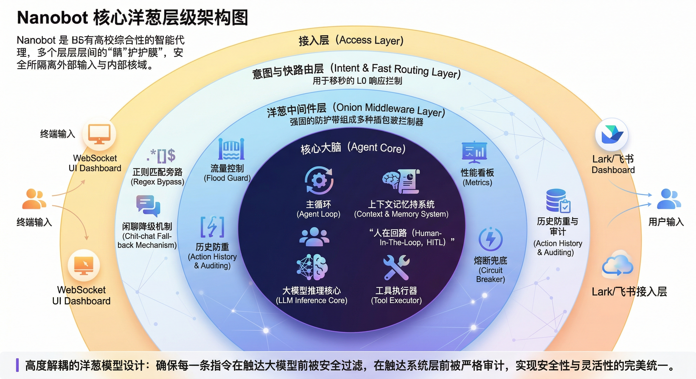
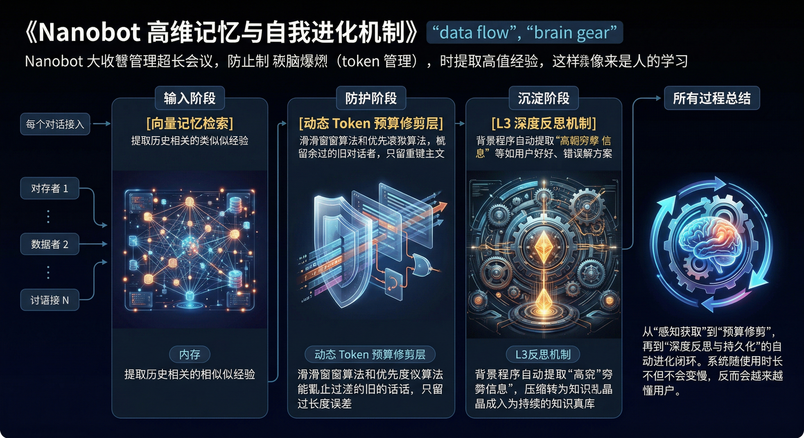
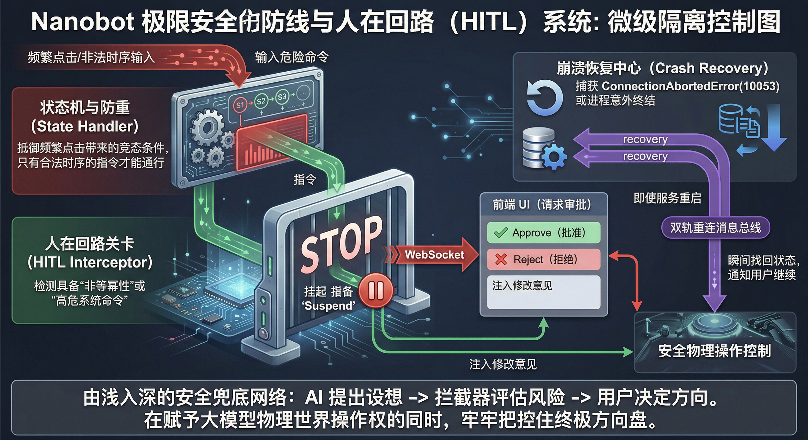
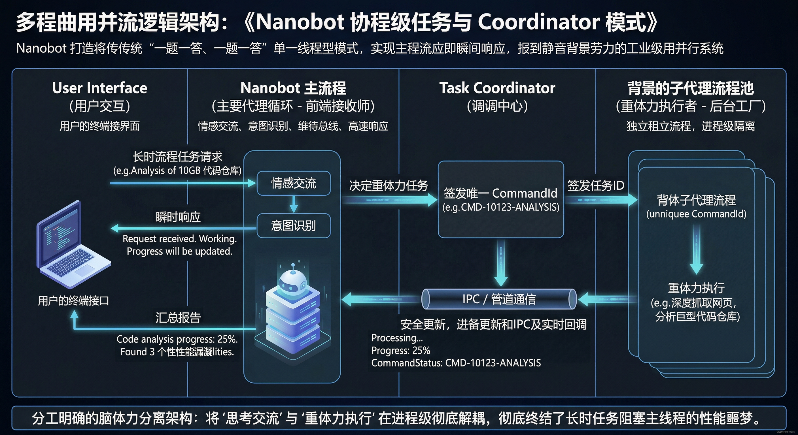
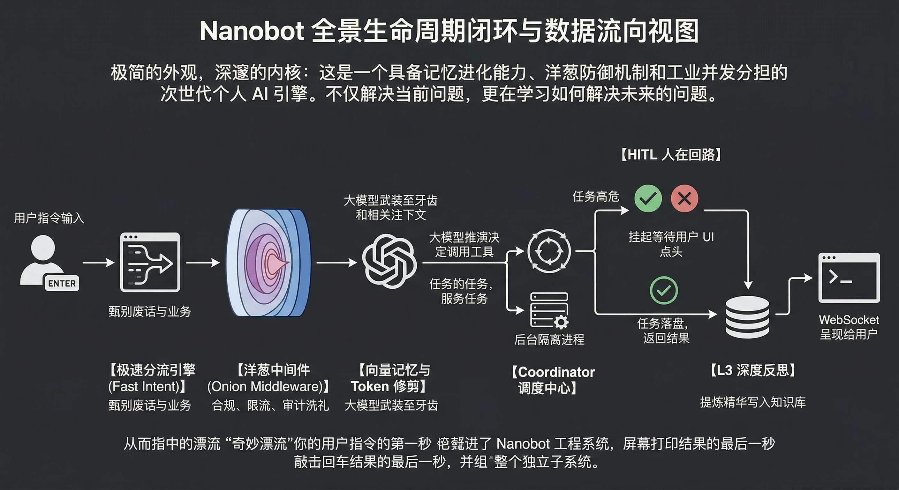

# Nanobot 核心架构基线设计文档 (v_latest)

> **文档说明：**
> 本文档是对 Nanobot 当前系统架构（特别涵盖 Phase 38 ~ Phase 41 期间的重大重构与演进）的详细全景总结。
> **目标：** 作为基线材料，供未来的 Harness 多模型辩证工作流使用，以便不同维度的 AI 角色围绕此设计寻找碰撞点、脆弱点，并推演未来的架构提升优化方案。
>
> **✅ 2026-04-06 Harness 审查状态：已完成 5 阶辩证评审（Claude Sonnet → Opus → Gemini High → Gemini Low → Claude Sonnet）。** 各节碰撞点的审查结论已标注于下方，详细 ADR 见 `docs/adr/ADR-42-harness-review.md`。

---

## 1. 宏观设计哲学

Nanobot 的核心设计理念从最初的"单兵作战大模型"演进为了目前的**"微隔离洋葱防御体系 + 脑体力解耦并发"**工业级智能体架构。系统强调：
- **无感拦截（Zero-intrusion）：** 所有防护措施作为独立中间件存在，不干扰核心推理逻辑。
- **动态呼吸响应：** 系统能根据意图的轻重缓急，自动选择快速旁路（正则/小模型）或重度推演管道（深层反思/大模型）。
- **进程级护栏：** 为解决长时任务阻塞和不可靠物理执行器导致的主进程崩溃，系统实行强力的进程隔离与兜底重连。

---

## 2. 系统核心链路拆解（End-to-End 流水线）

### 2.1 接入层与意图分发引擎 (Phase 39 极速路由与降级策略)

**设计内容：**
客户端（UI Dashboard, Lark 飞书等）的输入首先抵达意图层，为解决大模型硬路由带来的高延迟门槛，我们在网关处设计了极速路由。
- **正则表达式意图旁路 (Regex Bypass)：** 对常见的 L0 级寒暄（如"你好"、"在吗"），绕过所有重型处理，直接在毫秒级降级反馈。
- **动态大模型调度：** 如果是极简查询，调度器采用 `fast_model`（低延迟小模型）处理，节省成本与 TTFT。

> **✅ Harness 2026-04-06 审查结论：**
> - 正则旁路（`_CHITCHAT_REGEX`）含 `^...$` 全量锚点，无法被业务请求前缀误触。**已确认安全，旁路设计健全。**
> - ⚠️ 意图判定在 `_process_message` 和 `_execute_with_llm` 中存在**双重重复计算**（P2 代码债，Phase 42C 修复）。
> - `fast_model` 仍经过主 Agent 完整中间件管线，无安全降级风险。

---

### 2.2 洋葱中间件防御带 (Phase 41 Onion Middleware)

**设计内容：**
彻底废弃了曾经单体臃肿的 `_run_agent_loop`，将并发、安全、合规检查全部解耦为一层层的"薄膜"。请求在触达 Agent Brain 之前，必须穿透以下关卡：
- **Flood Guard（防洪中间件）：** 拦截恶意或失控脚本引发的无限死循环。
- **State Handler（并发防重与状态机）：** 强锁时间戳，防止竞态条件。
- **HITL (人在回路拦截器)：** 安全基石。高危操作在此层挂起，前端用户必须 Approve / Reject。
- **Metrics Dashboard：** 隐式收集各环节耗时。

> **✅ Harness 2026-04-06 审查结论：**
> - `abort()` 的 first-come-first-served 短路机制是**工业标准漏斗防洪设计，正确且应永久保留**。Opus 的 P1 定级已被驳回。
> - `_run_agent_loop()` 作为 Facade 门面路由，外部所有调用点（StateHandler HITL 恢复、Coordinator）均通过此路由自动感知 `middleware_enabled` 开关，无法被绕过。**已确认安全。**
> - 🚨 **P0 关键发现**：`SubagentManager._run_subagent` 维护独立裸循环，**完全绕过本节所有中间件**（Phase 42A 紧急修复）。

---

### 2.3 核心大脑层：高维记忆与防爆系统 (Phase 40 动态裁剪)

**设计内容：**
负责向大模型喂养最优质的数据，并在无限轮长对话中保证稳定。
- **动态 Token 预算修剪 (Dynamic Token-Budget Clipping)：** 使用滑动窗口及优先级衰减算法，自动截断长对话尾部。
- **长效向量记忆挂载 (Vector Memory)：** 被裁剪的数据以高维向量入库，在提问时通过 RAG 召回。

> **✅ Harness 2026-04-06 审查结论：**
> - Token Clipping 中"先向量化、后截断"的顺序在 `memory_manager.py` 中已正确保证，无数据黑洞风险。
> - 向量库存储 LLM 摘要而非原文是**经折中后确认的正确策略**（控制注入预算），但缺少 `origin_ref` 指针导致高置信命中后无法深层检索（Phase 43 升级为 Hybrid Lazy-RAG）。
> - ⚠️ `ReflectionStore`（JSON Jaccard）与 Experience Bank（VectorStore embedding）**双线并行存在注入预算浪费与幻觉级联风险**（P1 技术债，Phase 42B 统一）。

---

### 2.4 并发调度与隔离执行 (Phase 38 Coordinator & Sub-agents)

**设计内容：**
"脑体力分离"是本系统的工程亮点之一。主进程绝不执行重型耗时代码。
- **主代理引擎 (Main Agent Loop)：** 只负责语义理解、意图分发、安全审计以及与前端维持 WebSocket 连接。
- **任务分发器 (Coordinator Mode)：** 生成唯一 `CommandId` 分派子任务。
- **后台子代理池：** 完全在独立的协程或进程中执行，通过 IPC 进行进度交流与轮询。
- **崩溃恢复双轨制 (Crash Recovery)：** 通过双轨重连机制从持久层恢复任务，通知 UI "您有一个未完成的命令"。

> **✅ Harness 2026-04-06 审查结论：**
> - 🚨 **本节最高危发现**：当前 `SubagentManager._run_subagent` 维护独立裸 `while` 循环，其内置 `ExecTool` 可在**彻底绕过 HITL、FloodGuard、CircuitBreaker** 的情况下执行任意 Shell 命令。这是架构中最高危的 P0 运行时漏洞（Phase 42A 紧急修复）。
> - ADR-38-01 的真进程隔离蓝图（HTTP JSON-RPC IPC）仍处于 P3 预留，触发条件未变。
> - 当前协程方案依赖 `asyncio done_callback` 清理，子任务 OOM 时存在未追踪任务风险（进程隔离落地后自然解决）。

---

### 2.5 L3 深层反思沉淀层 (L3 Reflection)

**设计内容：**
Nanobot "自我进化"的体现。每次对话落地后，后台静默启动 L3 级别反思，抽取"高熵经验"重塑为 Knowledge Item 落盘，未来通过 RAG 检索复用。

> **✅ Harness 2026-04-06 审查结论：**
> - 幻觉级联（Hallucination Cascade）的根本来源是 ReflectionStore 与 Experience Bank 的**双写双路**，非单一反思机制本身的问题。统一至 Experience Bank 后风险大幅降低（Phase 42B）。
> - 当前 L3 反思作为 `asyncio fire-and-forget` 执行，无资源限额。建议未来纳入 Coordinator 任务池管控（与 Phase 38 协同）。
> - Experience Bank 已有 BM25 + 向量混合检索，精准度可接受，但小语料（<5 条）下的退化路径尚有回归测试缺口（见进度报告 DEBT-KB-1）。

---

## 3. 部署与技术底座

- **架构风格：** 洋葱重构（Onion Architecture）结合响应式状态机
- **通信标准：** WebSocket 双向流 + IPC
- **容灾手段：** 内存挂载持久化 + 截断恢复机制
- **模型驱动：** LLM（核心推演与反思）与 Regex/轻量级判定器并存

---

## 4. Harness 审查结论摘要 (2026-04-06)

> 本节记录 5 阶 Harness 辩证工作流的最终结论。详细 ADR 见 `docs/adr/ADR-42-harness-review.md`。

### 永不回退的核心护栏（坚守决策）

| 设计 | 状态 | 说明 |
|------|------|------|
| 洋葱中间件短路机制（`abort()` first-come-first-served） | 🔒 **永久保留** | 工业标准漏斗防洪设计，经 Gemini High + Low 双重确认正确，Opus 误判已驳回 |
| `_run_agent_loop()` Facade 门面路由 | 🔒 **永久保留** | 所有外部调用点必须经此路由，自动感知中间件开关，Opus 的 C4 指控经代码核实为幻觉 |
| 正则全量匹配寒暄旁路（`^...$` 锚点） | 🔒 **永久保留** | 无 HITL 绕过风险，Opus 的 P0 指控（C1）经代码核实后撤销 |
| Token Clipping + 摘要向量化策略 | 🔒 **以 Hybrid 形式演进** | 摘要作语义目录索引（控制预算），追加 `origin_ref` 指针实现按需深层检索（Phase 43） |

### 已识别、待修复的技术债

| 编号 | 优先级 | 问题描述 | 修复计划 |
|------|--------|---------|---------|
| C2 | 🚨 **P0** | SubagentManager 裸 while 循环绕过所有安全中间件 | Phase 42A |
| C6 | 🔴 P1 | ReflectionStore + Experience Bank 双脑并行，污染注入预算 | Phase 42B |
| C8 | 🟡 P2 | `loop.py` 2146 行上帝类，VLM 路由逻辑双重重复 | Phase 42C |
| C5 | 🔵 P3 | 向量库无 `origin_ref` 指针，高置信命中后无法深层检索 | Phase 43 |
