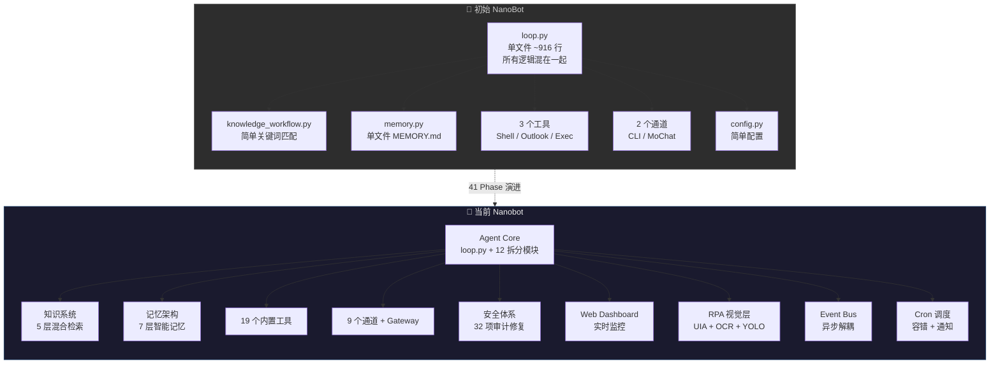

# Nanobot 演进全景对比

> 从一个简单的聊天机器人到企业级 AI Agent 框架的蜕变之路  
> 最后更新: 2026-04-03

---

## 工程规模对比

| 维度 | 🐣 初始 NanoBot | 🚀 当前 Nanobot | 增幅 |
|------|----------------|----------------|------|
| **核心源文件** | ~10 | **105** | **×10.5** |
| **测试文件** | 0 | **87** | 0 → 87 |
| **测试用例** | 0 | **1271+ passed** | 0 → 1271+ |
| **子包 (packages)** | 2 (`agent`, `config`) | **14** | **×7** |
| **内置工具 (Tools)** | 3 (shell, outlook, exec) | **19** | **×6.3** |
| **通道适配器 (Channels)** | 2 (CLI, MoChat) | **9** | **×4.5** |
| **Phase 迭代** | — | **41 个大阶段** | — |
| **论文参考** | 0 | **12** (AutoSkill, XSKILL, mem9, MemGPT, AI Memory Survey, MDER-DR, IndexRAG, OPENDEV, Dual-Tree, QChunker, OpenClaw-RL, BubbleRAG) | — |

---

## 架构演进全景图

---

## 历史演进归档

随着项目复杂度的增加，早期的全景演进和 Phase 更新日志已经被分类归档：

- [Epoch 1: Phase 1-20 演进回顾与架构对比](./EVOLUTION_epoch1_20.md)
- [Epoch 2: Phase 21-32 详细迭代历程](./EVOLUTION_epoch21_32.md)
- [Epoch 3: Phase 33-41 洋葱架构与安全降级纪元](./EVOLUTION_epoch33_41.md)

## 最新阶段核心内容 (Phase 42及以后)

有关当前开发进度和 Phase 42 及之后的迭代内容，请以此为唯一事实来源 (Single Source of Truth)：
- [Nanobot 开发进度与 Roadmap](../../progress_report.md)

> Note: 有关架构安全、最佳实践与具体开发规范，请参阅根目录 `docs/` 下的其他详细文档。
