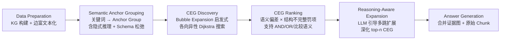

# BubbleRAG 论文分析报告 — 与 Nanobot 对比

> **论文**: BubbleRAG: Evidence-Driven Retrieval-Augmented Generation for Black-Box Knowledge Graphs  
> **作者**: Duyi Pan, Tianao Lou, Xin Li, et al. (HKUST-GZ)  
> **分析日期**: 2026-03-31

---

## 1. 论文核心摘要

### 解决什么问题？
LLM 在知识密集任务中存在幻觉问题。现有 Graph-RAG 方法在面对 **黑盒知识图谱**（schema 未知）时，存在三大挑战导致 Recall 和 Precision 损失：

| 挑战 | 说明 | 影响 |
|------|------|------|
| **语义实例化不确定性** | 查询概念在 KG 中可能以别名、属性值、隐式关系等多种形式出现 | Recall 损失 |
| **结构路径不确定性** | 即使找到实体，也不知道正确的连接路径（直接边 vs 多跳链） | Recall 损失 |
| **证据比较不确定性** | 多个候选满足约束时，KG 很少显式编码"重要性"等高阶概念 | Precision 损失 |

### 关键技术/架构？

BubbleRAG 是一个 **training-free、plug-and-play** 的五阶段 pipeline：



**核心创新**: 将检索形式化为 **OISR 问题**（Optimal Informative Subgraph Retrieval，Group Steiner Tree 变体），证明其 NP-hard 和 APX-hard，设计了 Bubble Expansion 启发式算法。

### 主要结果？

| 指标 | BubbleRAG (30B) | 最强 Baseline (HippoRAG2) | 优势 |
|------|----------------|--------------------------|------|
| **Average F1** | **63.02** | 60.50 | +2.52 |
| **Average ACC** | **66.63** | 64.40 | +2.23 |
| **MuSiQue F1** (最难) | **53.03** | 45.04 | **+8.0** |

> 特别是在需要 3-4 跳推理的 MuSiQue 上优势最大，且 8B 模型的表现可媲美其他方法的 30B 模型。

---

## 2. 特征对比表

| 维度 | 论文方案 (BubbleRAG) | Nanobot 现状 | 判定 |
|------|---------------------|-------------|------|
| **KG 构建** | LLM 提取三元组，边存富文本 `(A,R,B)` → edge 存 `"A R B"` | KG1: LLM 提取三元组 + `description` 字段保留自然语言上下文 | 🟢 Nanobot 已有（且 description 比 edge text concat 更灵活） |
| **实体消歧** | LLM 语义锚分组 + 隐式推理 + Anchor Specialization | KG2: 子串包含 + 大小写归一化启发式合并 | 🟡 相似但 BubbleRAG 更强（LLM-based 消歧 vs 规则消歧） |
| **多跳查询** | Bubble Expansion + CEG 生成连通子图覆盖多 anchor 组 | KG4: LLM 分解子查询 → 逐跳串行查找 → 简单变量替换 | 🔴 BubbleRAG 明显更强（图算法级别 vs 串行文本级别） |
| **检索排名** | 组合得分 = 语义偏差 × 结构不完整惩罚，支持 AND/OR 语义 | Hybrid Retrieval: BM25(0.3) + Dense(0.7) 线性加权 | 🟡 思路不同但各有优劣（BubbleRAG 面向图子图，Nanobot 面向文本条目） |
| **Schema 松弛** | Chunk 预览引导，检测到相关上下文后放宽严格匹配条件 | 无对应机制，严格关键词匹配 | 🔴 Nanobot 缺失 |
| **隐式/潜在关键词推理** | LLM 推断查询中未显式出现但必要的概念（如 "1921 Nobel Physics" → "Einstein"） | 无。关键词提取仅基于显式文本 | 🔴 Nanobot 缺失 |
| **Anchor 专精化** | 将泛化关键词改写为查询条件化约束（"mother" → "Lothair II's mother"） | 无对应机制 | 🔴 Nanobot 缺失 |
| **Bridging Facts** | 无（运行时通过 Bubble Expansion 动态发现） | P29-3: 离线 LLM 推导多跳桥接事实，存入图中 | 🟢 Nanobot 已有（且是互补思路：预计算 vs 运行时发现） |
| **语义分块** | 标准 LLM 分块 | KG5: 段落→句子边界语义分块 | 🟢 Nanobot 已有 |
| **实体摘要** | 无 (不需要，因为有图结构级检索) | KG3: LLM 批量生成实体摘要 + 同步 Vector DB | 🟢 Nanobot 已有 |
| **Retrieval 回退** | 空集时回退到 anchor 节点列表 | 5 层渐进回退: Exact → Substring → Jieba → BM25 → Dense | 🟢 Nanobot 回退链更成熟 |
| **Evidence 合并** | 多个 CEG 合并为统一证据图，去重节点/边 | 无（单次检索返回单个最佳匹配） | 🔴 Nanobot 缺失 |
| **训练需求** | Training-free, plug-and-play | Training-free | 🟢 一致 |
| **Experience Bank** | 无 | P29-1: 用户纠正 → Directive Signal → 战术提示注入；P29-5: 错误自动分析 → 经验存储 | 🟢 Nanobot 独有特性 |
| **验证/安全层** | 无 | L0/L1/L3 漏斗验证 + HITL 审批 + RiskTier 风险分级 | 🟢 Nanobot 独有特性 |

---

## 3. 借鉴意见

### ⭐ 值得借鉴

#### 3.1 Semantic Anchor Grouping（语义锚分组）
**论文做法**: 用 LLM 从查询中提取关键词时，不仅识别显式实体，还推断 **隐式必要概念**（如 "1921 Nobel Physics" → "Einstein"）。然后将同一概念的多个候选节点归入同一组，每组分配重要性权重。

**Nanobot 可借鉴方式**: 
- 在 `knowledge_graph.py` 的 `get_entity_context()` 和 `resolve_multihop()` 中，增加一个 **LLM 预处理步骤**：将用户查询先经过一次轻量 LLM 调用，推断隐式概念并展开为多个搜索词
- 修改 `get_entity_context()` 的匹配逻辑，支持 **多候选锚点**（当前只做单次遍历匹配）
- 在 `hybrid_retriever.py` 中增加 **query expansion** 预处理

**估计工作量**: ~2-3 天（主要改动: `knowledge_graph.py`、`hybrid_retriever.py`）

**ROI**: ⭐⭐⭐⭐ 高（直接提升多跳查询召回率，复用现有 LLM provider）

---

#### 3.2 CEG Ranking 组合得分思想
**论文做法**: 用复合得分排序候选证据图：`Score(T) = 1 / (SemanticCost × MissingPenalty + ε)`，其中 Missing Penalty 使用指数惩罚 `e^(α·r_miss)` 对缺失高权重锚组严厉惩罚。

**Nanobot 可借鉴方式**: 
当前 `hybrid_retriever.py` 用线性加权 `combined = dense × 0.7 + bm25 × 0.3`，缺乏对 **结构完整性** 的惩罚。可以引入：
- **Coverage Penalty**: 如果查询包含多个关键概念而候选结果只覆盖了部分，应用指数衰减惩罚
- **Concept Weight**: 对核心实体 vs 修饰词赋予不同权重（类似 BubbleRAG 的 importance weight）

```python
# 概念实现
coverage = covered_concepts / total_concepts
penalty = math.exp(alpha * (1 - coverage))
combined_score = raw_score / penalty
```

**估计工作量**: ~1 天（修改 `hybrid_retriever.py`）

**ROI**: ⭐⭐⭐ 中高（改善多条件查询的精度，改动小）

---

#### 3.3 Schema Relaxation via Chunk Preview（Schema 松弛）
**论文做法**: 检索前先预取 top-k 文本块作为 "社区预览"。如果文本块确认了某些关键概念的共现，则放宽严格匹配条件（如 "second marriage" → "marriage"）。

**Nanobot 可借鉴方式**:
- 在 `get_entity_context()` 匹配失败时，用 Vector DB 的 top-k 结果作为 "预览"
- 如果 Vector DB 结果中多个查询关键词共现，则对单个关键词的匹配阈值适当降低
- 这与现有的 Phase 28C（KG 实体摘要同步到 Vector DB）天然互补

**估计工作量**: ~1 天

**ROI**: ⭐⭐⭐ 中高（利用现有 Vector DB 基础设施，几乎无需新增依赖）

---

### 🟢 Nanobot 已经更好

#### 3.4 Triple Description > Edge Text Concatenation
BubbleRAG 通过将 `(A, R, B)` 拼接为 edge text `"A R B"` 来实现边级语义匹配。Nanobot 的 KG1 方案更优：每个三元组独立存储 `description` 字段，保留时间、条件、范围等精细上下文，且不受拼接噪声影响。

#### 3.5 Offline Bridging Facts > Runtime Discovery
BubbleRAG 依赖运行时 Bubble Expansion 发现多跳关系，耗时 ~21s/query。Nanobot P29-3 的离线桥接事实生成将多跳推理的成本分摊到索引阶段，查询时直接命中，延迟更低。两种方案互补但 Nanobot 的方案在个人 Agent 场景下更实用。

#### 3.6 Experience Bank（经验库）是 BubbleRAG 完全不具备的维度
Nanobot 的 P29-1 Directive Signal、P29-5 自动经验生成、以及 Outcome Tracker 构成了一个 **自我进化能力**，BubbleRAG 作为静态 pipeline 完全不涉及。

#### 3.7 5-Layer Retrieval Fallback Chain
Nanobot 的 Exact → Substring → Jieba → BM25 → Dense 渐进回退链比 BubbleRAG 的简单 fallback（返回 anchor 节点列表）更健壮、更优雅。

---

### 🔴 不值得加入

#### 3.8 Bubble Expansion 图算法核心
**原因**: BubbleRAG 的 Bubble Expansion 是一个完整的图遍历算法（各向异性 Dijkstra + bitmask 碰撞检测 + Group Steiner Tree 启发式），需要在内存中维护完整的 KG 拓扑结构。Nanobot 的 KG 设计为轻量级 JSON 文件（MAX_TRIPLES=500），引入这种算法级别的图遍历需要：
1. 升级存储到图数据库（Neo4j 或至少 networkx）
2. 维护邻接表和倒排索引
3. 实现多源 Dijkstra 和 bitmask 状态管理

**估计工作量**: 2-3 周，且引入显著架构复杂度

**与 Nanobot 哲学冲突**: Nanobot 遵循 "单智能体、零额外架构成本" 原则，引入图数据库违反此原则。

#### 3.9 CEG Discovery + Fusion（候选证据图发现与合并）
**原因**: 需要 Bubble Expansion 作为前置，且 Nanobot 的场景（个人记忆 + 任务知识）不是 BubbleRAG 面向的大规模多文档问答场景。Nanobot 的知识图谱是 500 条三元组的小规模个人知识库，不是 Wikipedia 级别的黑盒 KG。

#### 3.10 Reasoning-Aware Expansion（推理感知扩展）
**原因**: 这是在 CEG 基础上用 LLM 进一步扩展邻域节点。Nanobot 已有 KG4 分解查询 + 串行查找机制，在小规模图上效果相当，且不需要维护复杂的邻域图结构。

#### 3.11 OISR 形式化问题定义
**原因**: 这是学术贡献（证明 NP-hard 和 APX-hard），对工程实现没有直接指导意义。Nanobot 不需要在产品代码中引入组合优化理论。

---

## 4. 优先级推荐表

| 优先级 | 借鉴项 | 来源 | 估计工作量 | 理由 |
|--------|--------|------|-----------|------|
| **P0** | Semantic Anchor Grouping（查询隐式概念推理 + 多候选锚） | BubbleRAG §3.2 | 2-3 天 | 直接提升 KG4 多跳查询召回，复用现有 LLM，改动面可控 |
| **P1** | CEG Ranking 组合得分（Coverage Penalty + Concept Weight） | BubbleRAG §3.4 | 1 天 | 改善 hybrid_retriever 精度，改动极小（仅修改评分公式） |
| **P2** | Schema Relaxation via Chunk Preview | BubbleRAG §3.2 (bottom) | 1 天 | 利用现有 Vector DB，提升 tolerant matching，无新依赖 |

---

## 5. Nanobot 领先领域

以下领域论文完全不涉及，验证了 Nanobot 现有架构决策的正确性：

| Nanobot 特性 | 意义 |
|-------------|------|
| **Experience Bank + Directive Signal (P29)** | 自我进化能力——从用户反馈中持续学习，BubbleRAG 作为静态 pipeline 不具备 |
| **L0/L1/L3 验证漏斗 (Phase 31/32)** | 安全护栏——BubbleRAG 无任何安全层，Nanobot 的分级验证在产品化中至关重要 |
| **5-Layer Hybrid Retrieval + Adaptive Threshold** | 健壮的渐进回退——BubbleRAG 的 fallback 机制远不如 Nanobot 成熟 |
| **RPA + Browser 降级链路 (Phase 33)** | 多模态执行——BubbleRAG 仅面向 QA，Nanobot 是全栈 Agent |
| **Knowledge Graph Triple Description (KG1)** | 比 BubbleRAG 的 edge text concat 更精细的上下文保留 |
| **Offline Bridging Facts (P29-3)** | 更经济的多跳关系发现——索引时预计算，查询时零延迟 |

---

## 6. 不推荐项目清单

| 项目 | 理由 |
|------|------|
| Bubble Expansion 图算法 | 需要图数据库，违反 "零额外架构" 原则，工作量 2-3 周 |
| CEG Discovery + Fusion | 依赖 Bubble Expansion，且 Nanobot 不是大规模 KG 场景 |
| Reasoning-Aware Expansion | 现有 KG4 分解查询在小图上已够用 |
| OISR 形式化定义 | 学术贡献，对工程无直接价值 |

---

## 7. 总结

BubbleRAG 是一篇扎实的 Graph-RAG 论文，在多跳 QA benchmark 上取得了 SOTA 结果。但其核心创新（Bubble Expansion 算法）依赖于大规模黑盒知识图谱场景，与 Nanobot 的轻量级个人 Agent 定位不匹配。

**最有价值的收获**不是其图算法，而是其 **检索增强思想**：
1. 查询时推断隐式概念（P0）
2. 对检索结果做结构完整性惩罚（P1）  
3. 利用初步检索结果放宽后续匹配条件（P2）

这三项都可以在 **不引入新依赖、不改变架构** 的前提下在 1 周内集成到 Nanobot 现有的 `knowledge_graph.py` 和 `hybrid_retriever.py` 中。
